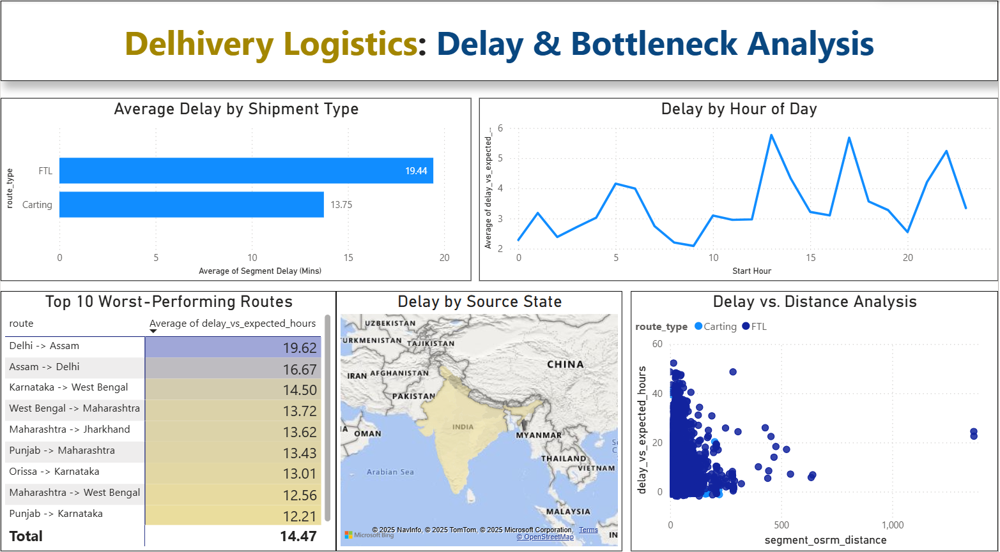

# RoaDo Data Analyst Assignment: B2B Logistics Delay Analysis

**Candidate:** Pandeti Mohan Sai
**Position:** Data Analyst Intern

---

### 1. Project Overview

This project is my submission for the Data Analyst Intern take-home assignment. The goal was to source, clean, analyze, and present insights from a business-relevant dataset.

Given RoaDo's focus on the "manufacturing supply chain," I chose a **B2B Logistics Dataset** from Delhivery. This allowed me to analyze the exact problems RoaDo solves, namely shipment delays and network bottlenecks.

---

### 2. Final Dashboard

Here is a snapshot of the final 5-visual dashboard built in Power BI to analyze the root causes of delays.

---

### 3. My Analytical Process

1.  **Data Sourcing:** I selected a real-world dataset of ~114,000 B2B shipment segments (FTL & Carting) from Kaggle.
2.  **Data Cleaning (Python):** The `data_cleaning.ipynb` notebook contains all Python code used to clean and prepare the raw data. This script handles null values, converts data types, and engineers new features like `route` and `source_state`.
3.  **Analysis & Visualization (Power BI):** The `Insights Report.pbix` file is the final, interactive dashboard. Inside, I created DAX measures like `Segment Delay (Mins)` to build the 5 key insights.
4.  **Reporting:** The `Analytics Report.pdf` contains the final write-up of the 5 key insights, and the `Final Presentation.pptx` summarizes the project for business stakeholders.

---

### 4. Key Insights

My analysis, detailed in the `Analytics Report.pdf`, uncovered 5 key findings:

1.  **FTL shipments are 41% more delayed** than 'Carting' shipments.
2.  **Delays are geographically concentrated** in a few "hotspot" states.
3.  **Delays are predictable by time**, spiking overnight (10 PM - 4 AM) and during the evening rush (4 PM - 6 PM).
4.  **A "Top 10" list of routes** accounts for a disproportionate amount of the total delay.
5.  The core problem is **PROCESS, not DISTANCE**, as there is no correlation between segment distance and segment delay.

---

### 5. Files in this Submission

* `Dataset Selection Document.docx`: (Deliverable 1) My project proposal and data selection.
* `data_cleaning.ipynb`: (Deliverable 2) The commented Python (Jupyter) script used for all data cleaning.
* `Analytics Report.pdf`: (Deliverable 3) The final 3-page report with all 5 insights and business implications.
* `Insights Report.pbix`: The final Power BI dashboard file containing the 5-visual analysis.
* `Final Presentation.pptx`: (Deliverable 4) The optional 5-slide summary presentation.
* `dashboard_snapshot.png`: The screenshot of the final dashboard.
* `README.md`: This file.
